# Example 01: Public Priority Failover (Front Door Basics)

In this first Azure Front Door example, we deploy a **Standard Azure Front Door** profile in front of two complete regional HTTP origins using **Terraform / OpenTofu**.

Each region contains an independent VNet, private Linux VM running NGINX, NAT Gateway, NSG, and public Standard Load Balancer. Its purpose is to provide a **deployable and testable baseline** for health-driven primary/standby routing.

---

## 🧭 Architecture Overview

Requests arrive at the Front Door anycast edge and are routed over HTTP to the public Load Balancer in West Europe while its priority `1` origin is healthy. The North Europe Load Balancer is priority `2` and receives traffic only when the primary origin is unhealthy.

The Load Balancers forward traffic to private VMs. Cloud-init installs NGINX and writes a regional identity page plus `/health`. NAT Gateways provide outbound access for package installation; neither VM has a public IP.

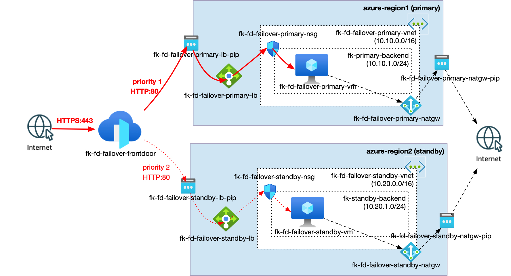

*Figure 1. Azure Front Door priority-based failover between independent primary and standby regional NGINX origins behind public Standard Load Balancers.*

This example creates:

- One Azure Resource Group
- Two independent regional VNets and backend subnets
- Two subnet-level NSGs allowing Front Door HTTP traffic and Load Balancer probes
- Two NAT Gateways with dedicated public IPs for VM egress
- Two private Linux VMs created by `terraform-az-fk-compute` v0.4.1
- Cloud-init configuration that installs NGINX and exposes `/health`
- Two public Standard Load Balancers created by `terraform-az-fk-loadbalancer` v1.2.1
- One Standard Azure Front Door profile and endpoint
- One origin group with an HTTP probe targeting `/health`
- Two regional Load Balancer origins
- One default route matching `/*`
- Priority-based failover from primary to standby

The two VNets are intentionally not peered. Cross-region peering belongs to the later orchestrator blueprint, where it will support an explicit inter-region requirement. This example is stateless and contains no database replication.

---

## 🎯 Why this example exists

Before introducing:

- Premium Private Link origins,
- Front Door WAF policy attachment,
- custom domains and certificates,
- or enterprise database replication,

it is critical to understand **how the endpoint, route, origin group, health probe, origin priority, and origin weight work together**.

This example focuses on:

- Standard-tier global HTTP(S) routing
- Public Load Balancer origins backed by private compute
- Primary/standby failover semantics
- Explicit health verification
- Regional independence without cross-region peering
- Composition of focused, version-pinned FoggyKitchen modules

---

## 🚀 Deployment Steps

```bash
cp terraform.tfvars.example terraform.tfvars
tofu init
tofu plan
tofu apply
```

The example creates its own Resource Group. Review the two regions and VM size in `terraform.tfvars` before deployment. No SSH private key is written to an output; the generated key exists only in Terraform state.

---

## 🖼️ Azure Portal View

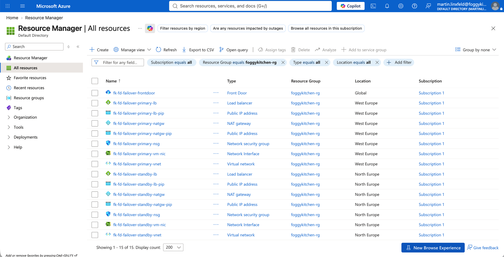

*Figure 2. Resources deployed into `foggykitchen-rg`, including the global Front Door profile and the independent West Europe and North Europe regional stacks.*

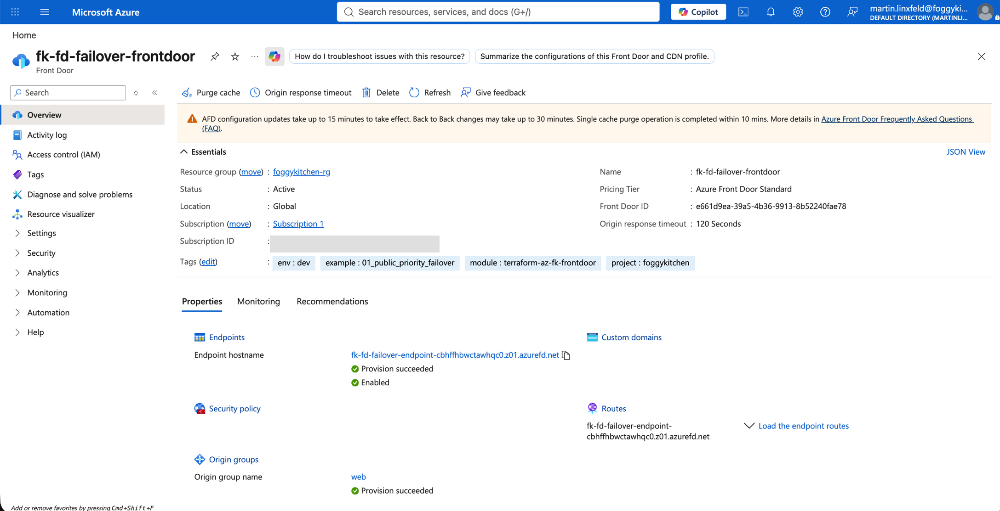

*Figure 3. Standard Azure Front Door profile with an active endpoint and the `web` origin group.*

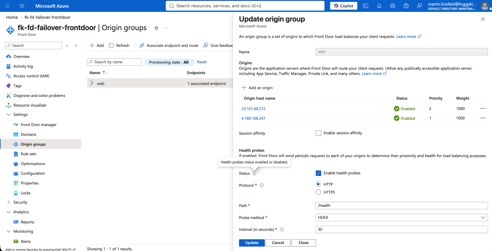

*Figure 4. The `web` origin group with the primary origin at priority `1`, the standby origin at priority `2`, equal weights, and an HTTP `HEAD /health` probe.*

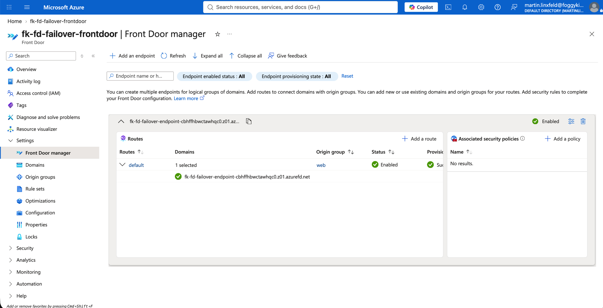

*Figure 5. Enabled default Front Door route associating the endpoint domain with the `web` origin group.*

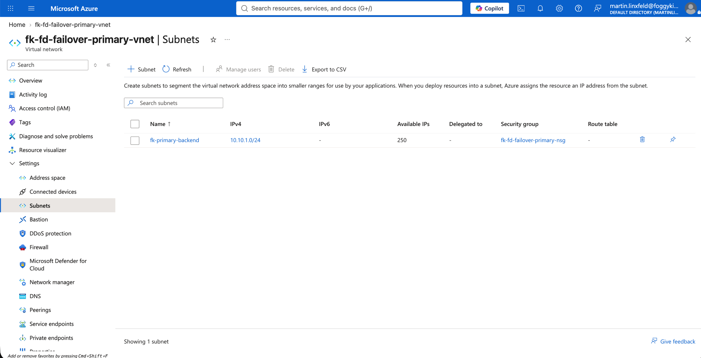

*Figure 6. Primary West Europe VNet and the `fk-primary-backend` subnet with address prefix `10.10.1.0/24`.*

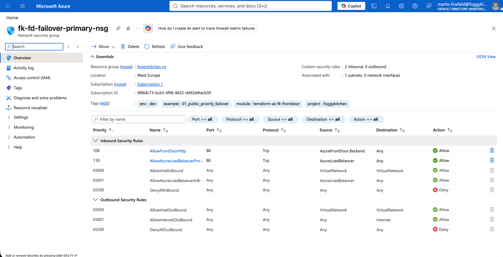

*Figure 7. Primary subnet NSG allowing HTTP from the `AzureFrontDoor.Backend` service tag and health probes from `AzureLoadBalancer`.*

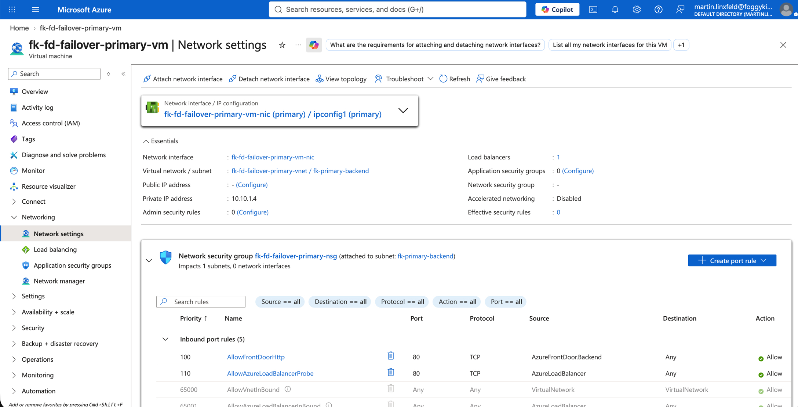

*Figure 8. Primary private VM networking, including its subnet, private IP address, Load Balancer association, and effective subnet NSG rules.*

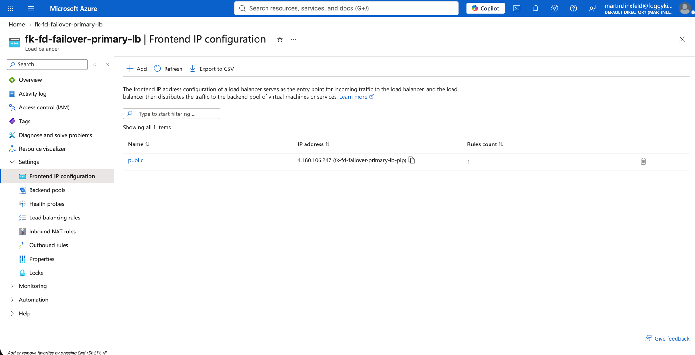

*Figure 9. Primary Standard Load Balancer public frontend used as the priority `1` Front Door origin.*


*Figure 10. Primary Load Balancer `nginx` backend pool containing the running primary VM.*

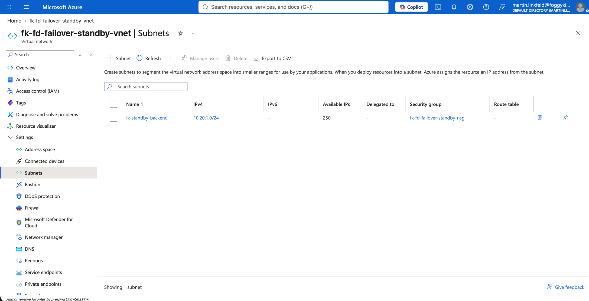

*Figure 11. Standby North Europe VNet and the `fk-standby-backend` subnet with address prefix `10.20.1.0/24`.*


*Figure 12. Standby subnet NSG with the same restricted Front Door traffic and Load Balancer probe rules as the primary region.*

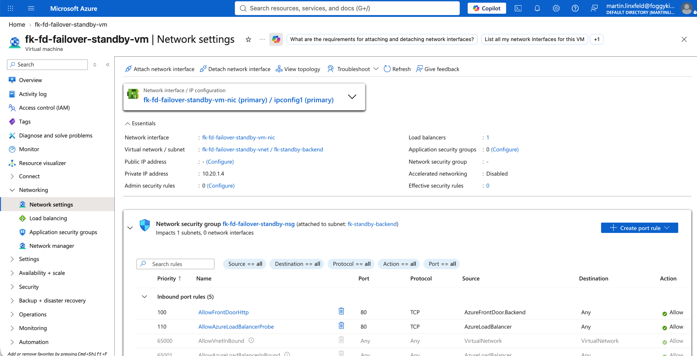

*Figure 13. Standby private VM networking, including its North Europe subnet, private IP address, Load Balancer association, and subnet NSG.*

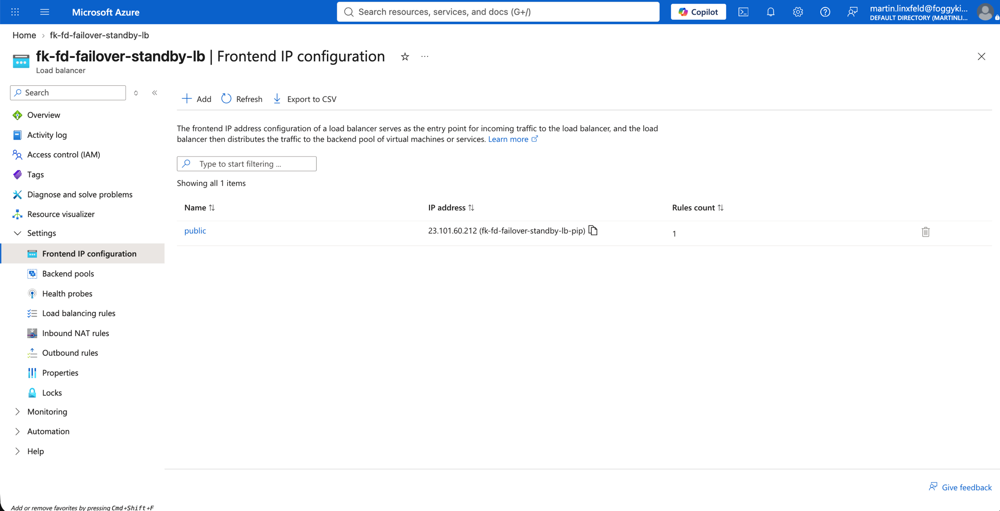

*Figure 14. Standby Standard Load Balancer public frontend used as the priority `2` Front Door origin.*

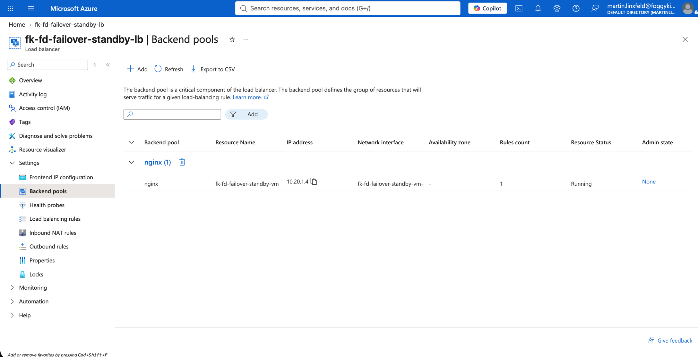

*Figure 15. Standby Load Balancer `nginx` backend pool containing the running standby VM.*

---

## ✅ Test Results

The example was deployed and tested on October 8, 2026. OpenTofu created the regional infrastructure and Front Door configuration successfully. A post-deployment `tofu plan` reported no changes.

First, retrieve the deployed Front Door hostname and verify normal routing while both origins are healthy:

```bash
FRONTDOOR_HOSTNAME="$(tofu output -raw frontdoor_endpoint_host_name)"
curl --fail --show-error --silent "https://${FRONTDOOR_HOSTNAME}/"
```

The request returned HTTP `200` from the priority `1` origin:

```text
Region: westeurope
Role: primary
```

The primary VM was then deallocated with Azure CLI to make its Load Balancer origin unhealthy:

```bash
az vm deallocate \
  --resource-group foggykitchen-rg \
  --name fk-fd-failover-primary-vm

az vm get-instance-view \
  --resource-group foggykitchen-rg \
  --name fk-fd-failover-primary-vm \
  --query "instanceView.statuses[1].displayStatus" \
  --output tsv
```

After Azure CLI reported `VM deallocated`, wait for Front Door health evaluation and repeat the request. The query parameter avoids reusing an earlier request URL during verification:

```bash
curl --fail --show-error --silent \
  "https://${FRONTDOOR_HOSTNAME}/?test=failover"
```

The same Front Door hostname returned HTTP `200` from the priority `2` origin:

```text
Region: northeurope
Role: standby
```

Finally, start the primary VM again and confirm that Azure reports it as running:

```bash
az vm start \
  --resource-group foggykitchen-rg \
  --name fk-fd-failover-primary-vm

az vm get-instance-view \
  --resource-group foggykitchen-rg \
  --name fk-fd-failover-primary-vm \
  --query "instanceView.statuses[1].displayStatus" \
  --output tsv
```

Azure CLI returned `VM running`. Front Door uses the configured 10-minute traffic restoration period before returning traffic to a healed higher-priority origin.

---

## 🧹 Cleanup

Azure Front Door, NAT Gateways, public IPs, Load Balancers, and Virtual Machines are billable services. Destroy the example when it is no longer needed:

```bash
tofu destroy
```

---

## 🪪 License

Licensed under the **Universal Permissive License (UPL), Version 1.0**.
See [LICENSE](../../LICENSE) for details.

© 2026 [FoggyKitchen.com](https://foggykitchen.com) - Cloud. Code. Clarity.
