# Example 02: Premium Private Link Origin

In this example, we deploy **Azure Front Door Premium** with a Private Link origin backed by a private-only Azure Application Gateway using **Terraform / OpenTofu**.

The example is a complete, disposable composition. A private Linux VM runs NGINX behind Application Gateway, while Front Door reaches the gateway through its Azure-managed private endpoint connection. The VM has no public IP. Application Gateway has a compatibility public frontend required by the current AzureRM provider, but no listener uses it and application traffic remains on the private frontend.

---

## 🧭 Architecture Overview

Requests arrive at the Front Door anycast edge. Front Door connects privately to the Application Gateway Private Link service, Application Gateway forwards HTTP traffic to the private NGINX VM, and the VM returns a simple identity page plus `/health`.

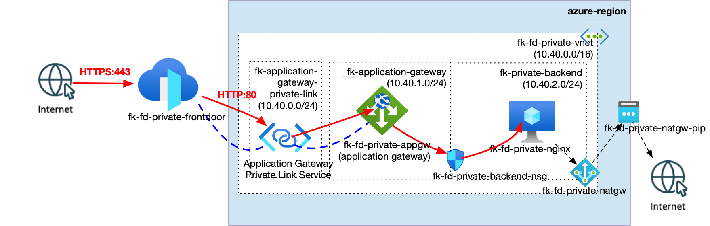

*Figure 1. Azure Front Door Premium reaches the private Application Gateway frontend through its Application Gateway Private Link Service. The gateway forwards HTTP traffic to a private NGINX VM protected by a subnet-level NSG, while a NAT Gateway provides outbound access for backend bootstrap without assigning a public IP to the VM. The temporary AzureRM compatibility public frontend is not part of the request path and is omitted from the diagram.*

This example creates:

- One Azure Resource Group
- One VNet with dedicated Application Gateway, Private Link, and backend subnets
- One subnet-level NSG allowing backend HTTP only from the Application Gateway subnet
- One NAT Gateway with a dedicated public IP for VM egress during cloud-init
- One private Linux VM created by `terraform-az-fk-compute` v0.4.1
- Cloud-init configuration that installs NGINX and exposes `/health`
- One Standard_v2 Application Gateway with a private application listener, created by `terraform-az-fk-application-gateway` v0.2.0
- One compatibility Standard Public IP attached to the unused Application Gateway public frontend
- One Application Gateway Private Link configuration and generated Private Link service
- One Premium Azure Front Door profile and endpoint
- One origin group with an HTTP `HEAD /health` probe
- One Front Door Private Link origin targeting the Application Gateway service
- One default route matching `/*`
- Optional Front Door diagnostics to an existing Log Analytics workspace

The dedicated `fk-application-gateway-private-link` subnet is required by Application Gateway Private Link and has Private Link service network policies disabled. The regional infrastructure remains outside the root Front Door module and is composed only at example level.

---

## 🎯 Why this example exists

This example proves the private-origin contract required by a future enterprise multi-region DR blueprint while keeping the global and regional modules independently reusable.

It focuses on:

- The Premium-only Front Door Private Link capability
- A private Application Gateway listener with an unused compatibility public frontend
- Composition with version-pinned FoggyKitchen VNet, NSG, NAT Gateway, compute, and Application Gateway modules
- The generated Application Gateway Private Link service ID consumed by the Front Door custom origin
- Required origin-side approval of Front Door's managed private endpoint request
- No public IP on the backend VM and no public Application Gateway listener

The separate `terraform-az-fk-waf-policy` module manages `azurerm_web_application_firewall_policy` for Application Gateway. It is not a Front Door WAF policy: Front Door requires `azurerm_cdn_frontdoor_firewall_policy`. WAF is therefore intentionally not added to this example.

---

## 🚀 Deployment Steps

```bash
cp terraform.tfvars.example terraform.tfvars
tofu init
tofu plan
tofu apply
```

The example creates its own Resource Group. Review the region, address ranges, and VM size in `terraform.tfvars` before deployment. No SSH private key is written to an output; the generated key exists only in Terraform state.

After apply, approve the pending Front Door managed private endpoint connection on the Application Gateway. Front Door origin health remains unavailable until that approval is complete.

---

## 🖼️ Azure Portal View

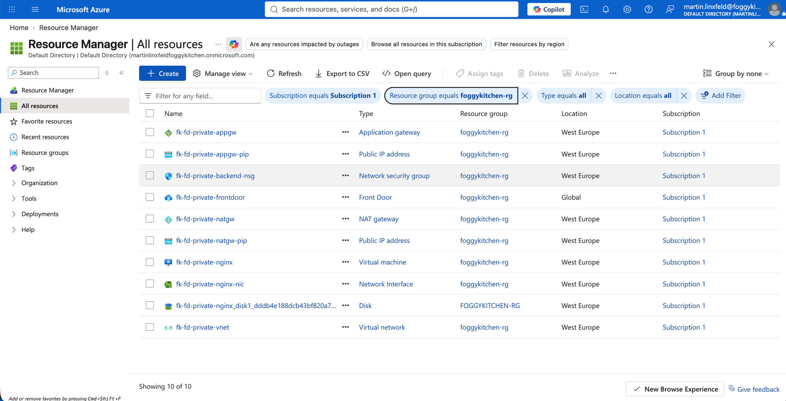

*Figure 2. Resources deployed into `foggykitchen-rg`, including the Premium Front Door profile, Application Gateway, private NGINX VM, VNet, backend NSG, NAT Gateway, and the compatibility public IP resources.*

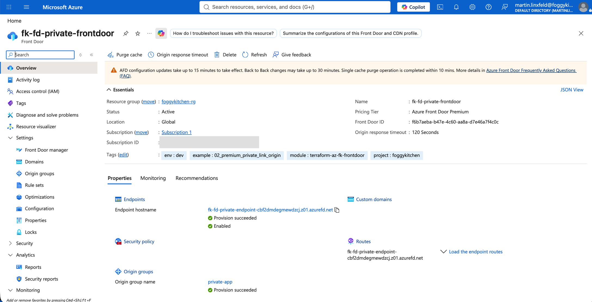

*Figure 3. Active Azure Front Door Premium profile with the enabled default endpoint and the successfully provisioned `private-app` origin group.*

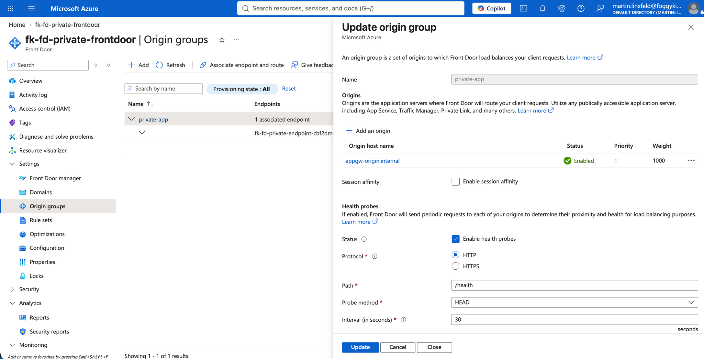

*Figure 4. The `private-app` origin group with its enabled Application Gateway origin at priority `1`, weight `1000`, and an HTTP `HEAD /health` probe running every 30 seconds.*

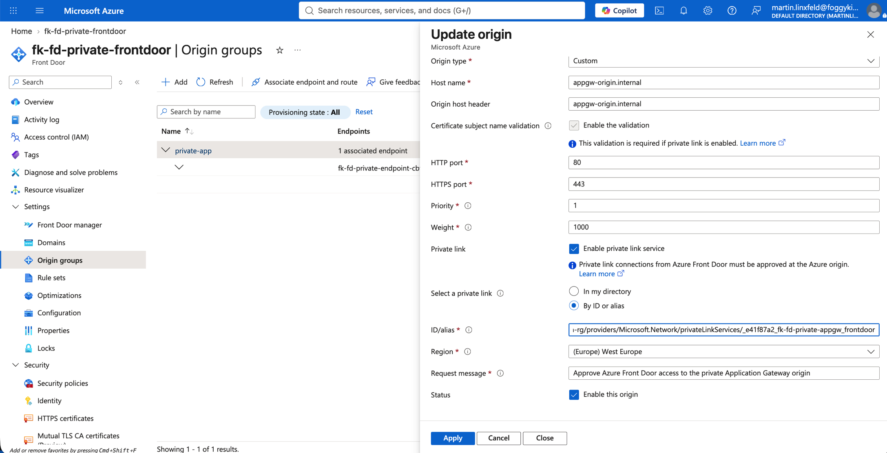

*Figure 5. Front Door custom origin configuration with certificate-name validation, HTTP port `80`, Private Link enabled, and the generated Application Gateway Private Link service selected by resource ID.*

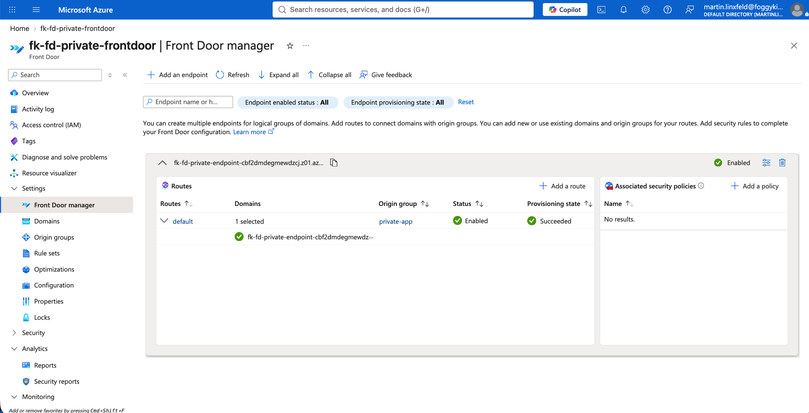

*Figure 6. Enabled and successfully provisioned default Front Door route associating the endpoint domain with the `private-app` origin group.*

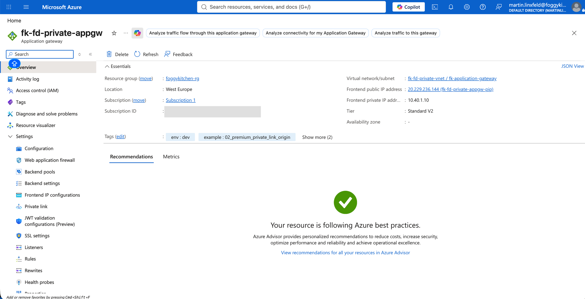

*Figure 7. Standard_v2 Application Gateway overview showing the gateway subnet, private frontend address `10.40.1.10`, and the compatibility public frontend.*

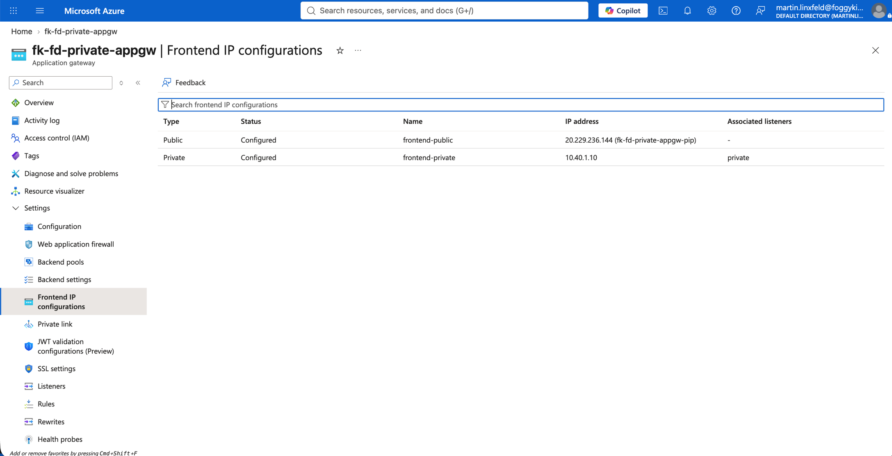

*Figure 8. Application Gateway frontend configurations. Only `frontend-private` is associated with the `private` listener; the `frontend-public` compatibility frontend has no listener.*

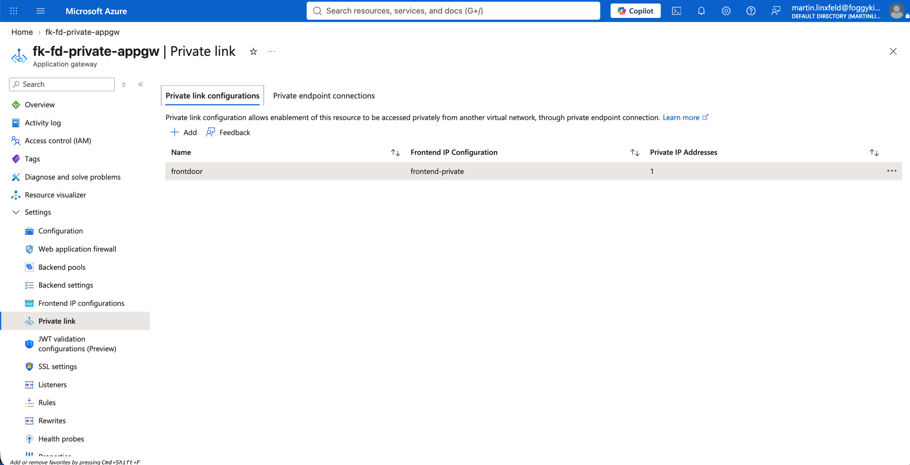

*Figure 9. Application Gateway Private Link configuration named `frontdoor`, associated with `frontend-private` and backed by one private IP address in the dedicated Private Link subnet.*

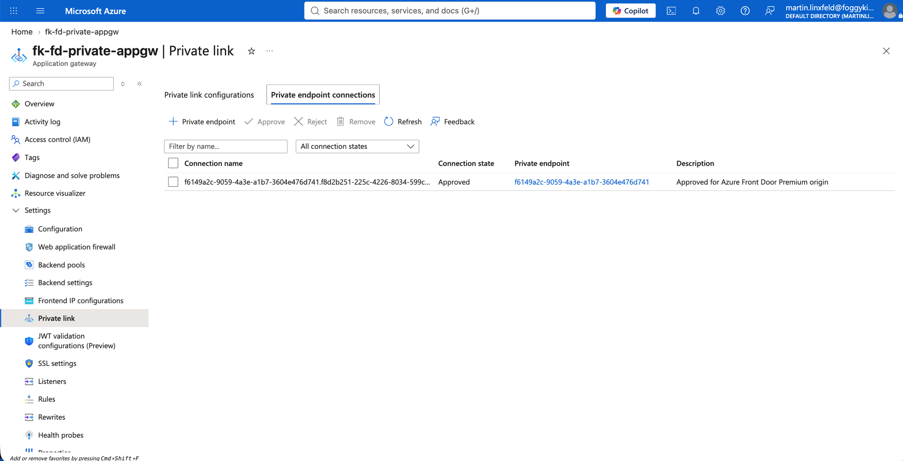

*Figure 10. Azure Front Door managed private endpoint connection approved on Application Gateway, enabling the private origin path.*

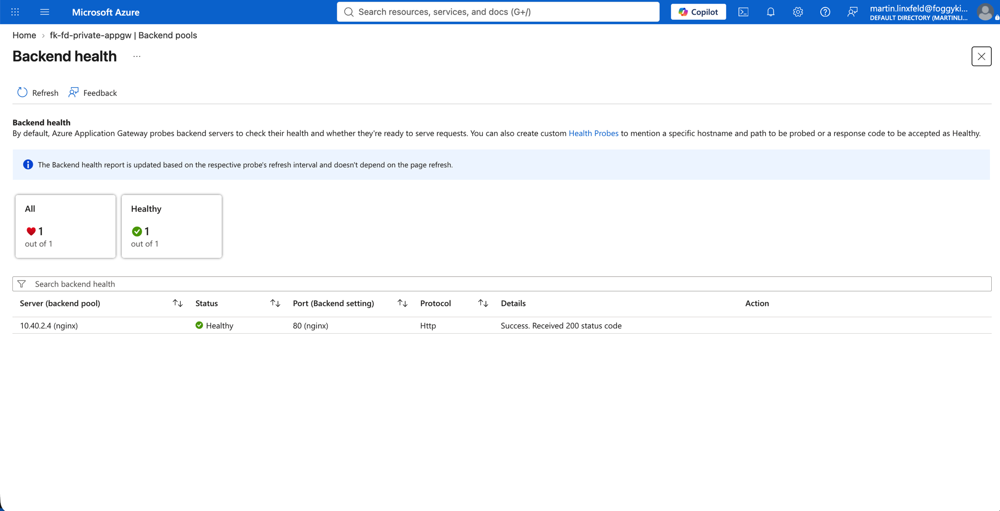

*Figure 11. Application Gateway backend health showing the NGINX server at `10.40.2.4` as healthy after a successful HTTP `200` probe.*

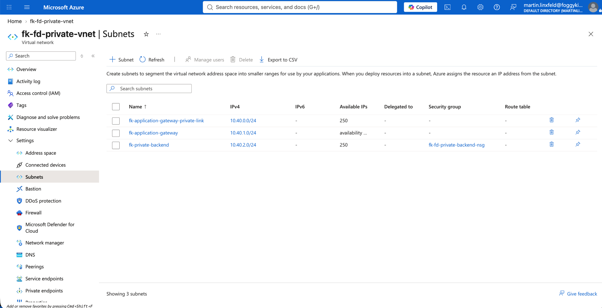

*Figure 12. The three purpose-specific VNet subnets: `fk-application-gateway-private-link` (`10.40.0.0/24`), `fk-application-gateway` (`10.40.1.0/24`), and `fk-private-backend` (`10.40.2.0/24`).*

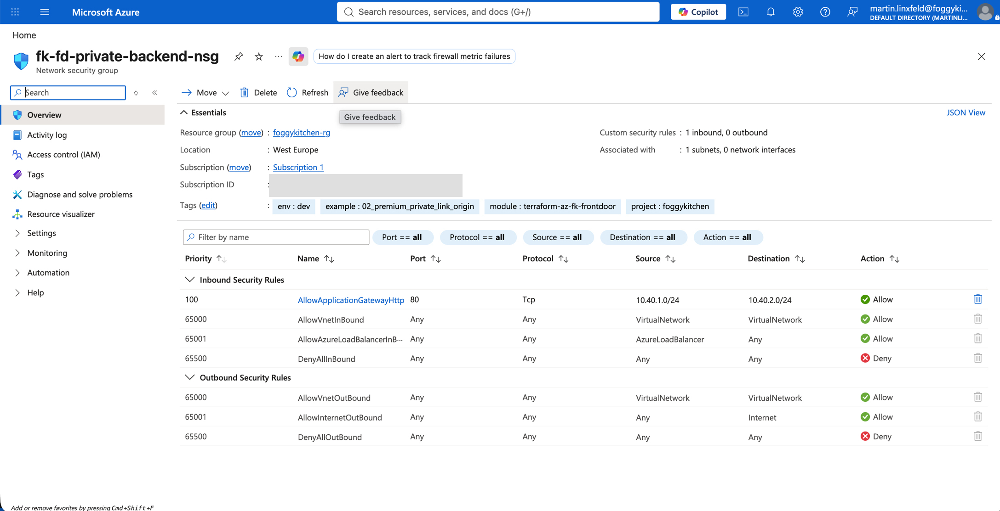

*Figure 13. Backend subnet NSG allowing TCP port `80` only from the Application Gateway subnet `10.40.1.0/24` to the backend subnet `10.40.2.0/24`.*

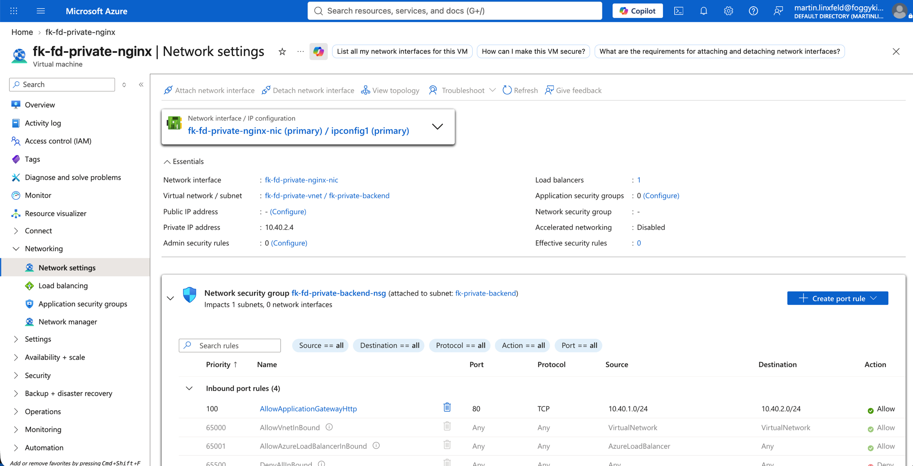

*Figure 14. NGINX VM networking with private address `10.40.2.4`, no public IP, membership in the `fk-private-backend` subnet, and the subnet-level backend NSG.*

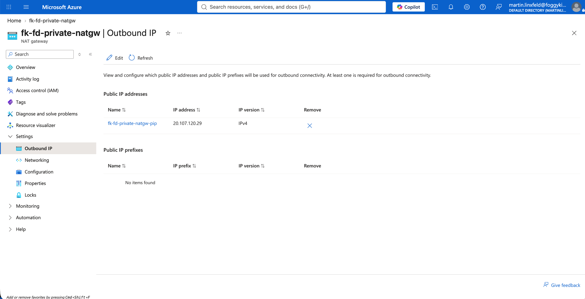

*Figure 15. NAT Gateway outbound public IP used by the private backend subnet for package installation during cloud-init without assigning a public IP to the VM.*

---

## ✅ Test Results

The example was deployed and tested on October 8, 2026 with AzureRM 4.81.0 and `terraform-az-fk-application-gateway` v0.2.0. OpenTofu created the complete topology successfully. The working Front Door origin targets the generated Application Gateway Private Link service ID; it does not target the compatibility public frontend.

First, verify that the subscription feature required for a private Application Gateway v2 deployment is registered:

```bash
az feature show \
  --namespace Microsoft.Network \
  --name EnableApplicationGatewayNetworkIsolation \
  --query properties.state \
  --output tsv
```

Azure CLI returned:

```text
Registered
```

List the managed private endpoint request and approve the pending connection:

```bash
PRIVATE_ENDPOINT_CONNECTION_ID="$(
  az network application-gateway show \
    --resource-group foggykitchen-rg \
    --name fk-fd-private-appgw \
    --query "privateEndpointConnections[?privateLinkServiceConnectionState.status=='Pending'].id | [0]" \
    --output tsv
)"

az network private-endpoint-connection approve \
  --id "${PRIVATE_ENDPOINT_CONNECTION_ID}" \
  --description "Approved for Azure Front Door Premium origin"

az network application-gateway show \
  --resource-group foggykitchen-rg \
  --name fk-fd-private-appgw \
  --query "privateEndpointConnections[].privateLinkServiceConnectionState.status" \
  --output tsv
```

The retained Front Door connection reported `Approved`.

Verify that only the private frontend is bound to an Application Gateway listener. The public frontend exists solely as a provider compatibility measure:

```bash
az network application-gateway http-listener list \
  --resource-group foggykitchen-rg \
  --gateway-name fk-fd-private-appgw \
  --query "[].{listener:name,frontend:frontendIpConfiguration.id}" \
  --output table
```

The only listener was `private`, associated with the `frontend-private` frontend at `10.40.1.10`. No listener used `frontend-public`.

Verify Application Gateway health-probe access to the private VM:

```bash
az network application-gateway show-backend-health \
  --resource-group foggykitchen-rg \
  --name fk-fd-private-appgw \
  --query "backendAddressPools[].backendHttpSettingsCollection[].servers[].{address:address,health:health,healthProbeLog:healthProbeLog}" \
  --output table
```

Azure reported the backend at `10.40.2.4` as `Healthy` with `Success. Received 200 status code`.

Confirm that the backend VM has no public IP:

```bash
az vm list-ip-addresses \
  --resource-group foggykitchen-rg \
  --name fk-fd-private-nginx \
  --query "[0].virtualMachine.network.publicIpAddresses" \
  --output json
```

The command returned an empty array.

Finally, retrieve the Front Door hostname and verify the full private request path:

After deployment and approval, retrieve the Front Door hostname and verify the full private request path:

```bash
FRONTDOOR_HOSTNAME="$(tofu output -raw frontdoor_endpoint_host_name)"
curl --fail --show-error --silent "https://${FRONTDOOR_HOSTNAME}/"
curl --fail --show-error --silent "https://${FRONTDOOR_HOSTNAME}/health"
```

Both requests returned HTTP `200`. The root response identified the tested path:

```text
FoggyKitchen private Front Door origin
Path: Front Door Premium - Private Link - Application Gateway - NGINX
```

The health endpoint returned:

```text
healthy
```

A final convergence check was run with the same variable file used for deployment:

```bash
tofu plan \
  -detailed-exitcode \
  -var-file=../../../terraform.tfvars_azure
```

OpenTofu returned exit code `0` and:

```text
No changes. Your infrastructure matches the configuration.
```

---

## 🧹 Cleanup

Azure Front Door Premium, Application Gateway, NAT Gateway, public IP, and Virtual Machine are billable services. Destroy the example when it is no longer needed:

```bash
PRIVATE_ENDPOINT_CONNECTION_IDS="$(
  az network application-gateway show \
    --resource-group foggykitchen-rg \
    --name fk-fd-private-appgw \
    --query "privateEndpointConnections[].id" \
    --output tsv
)"

while IFS= read -r connection_id; do
  if [ -n "${connection_id}" ]; then
    az network private-endpoint-connection delete \
      --id "${connection_id}" \
      --yes
  fi
done <<< "${PRIVATE_ENDPOINT_CONNECTION_IDS}"

tofu destroy
```

Azure can retain an approved Front Door managed private endpoint connection after the Front Door profile is deleted. Remove any remaining connection before `tofu destroy`; otherwise Azure blocks Application Gateway deletion with `ApplicationGatewayCannotBeDeletedDueToExistingPrivateEndpointConnections`. Because connection deletion is asynchronous, wait until the **Private endpoint connections** list is empty before continuing. A transient VM/NIC backend-pool detachment conflict can also require rerunning the same `tofu destroy` command after VM deletion completes.

---

## 🪪 License

Licensed under the **Universal Permissive License (UPL), Version 1.0**.
See [LICENSE](../../LICENSE) for details.

© 2026 [FoggyKitchen.com](https://foggykitchen.com) - Cloud. Code. Clarity.
